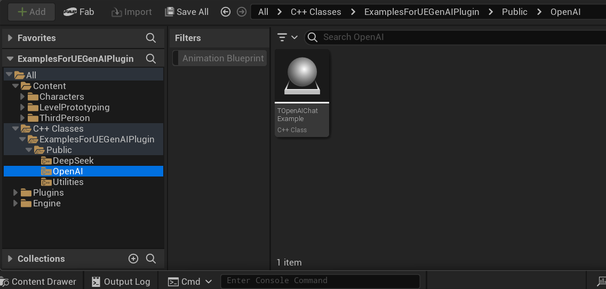

Please refer to [UnrealGenAISupport](https://github.com/prajwalshettydev/UnrealGenAISupport) plugin for more info.

## How to use this project:

Drag and drop either the C++ classes or the Blueprint classes into your project. You should see appropriate api responses in the Log.

C++ example classes location:

## About:
Unreal Engine Version: 5.4.4 